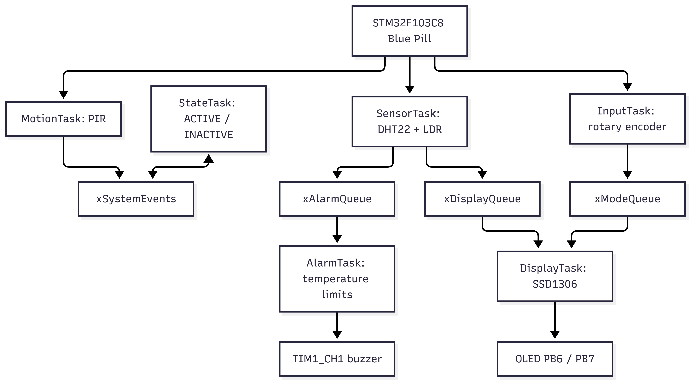
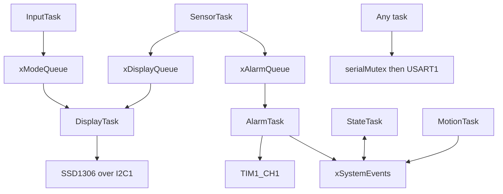
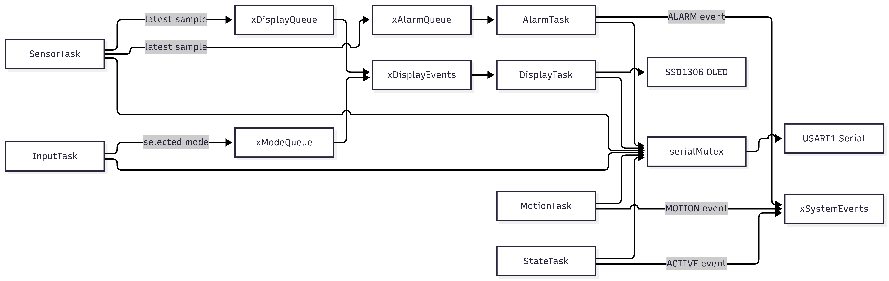
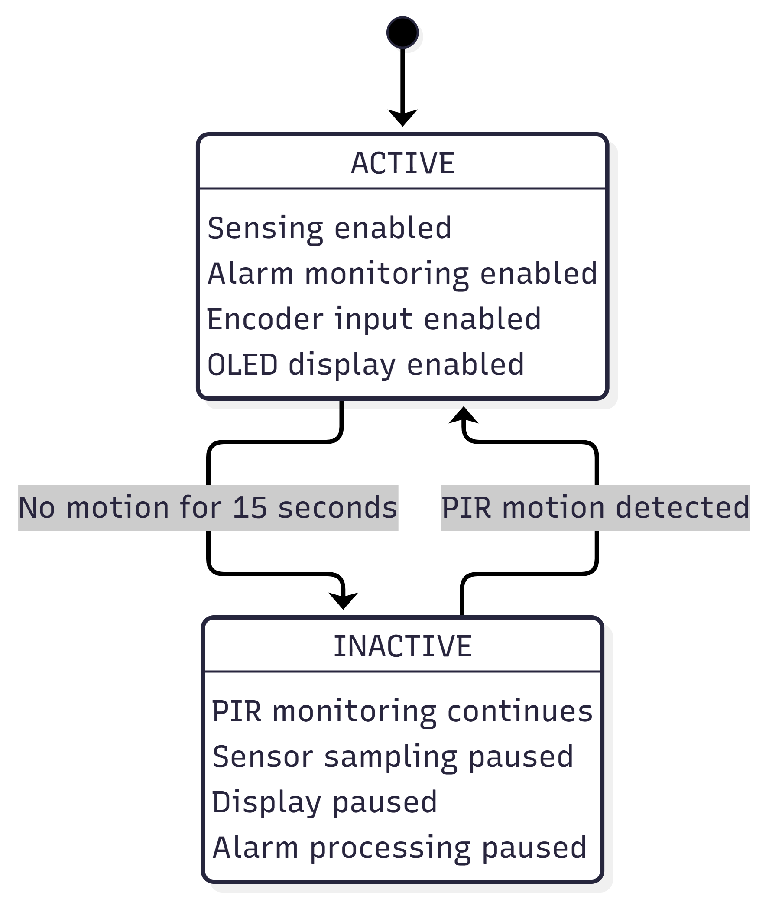
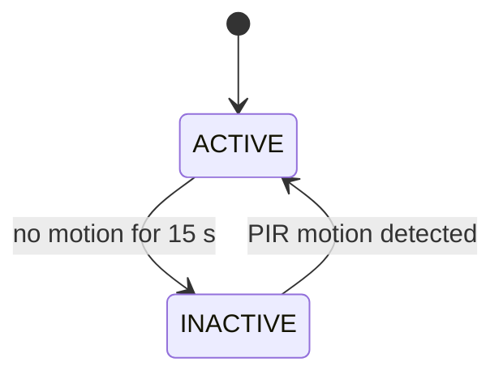
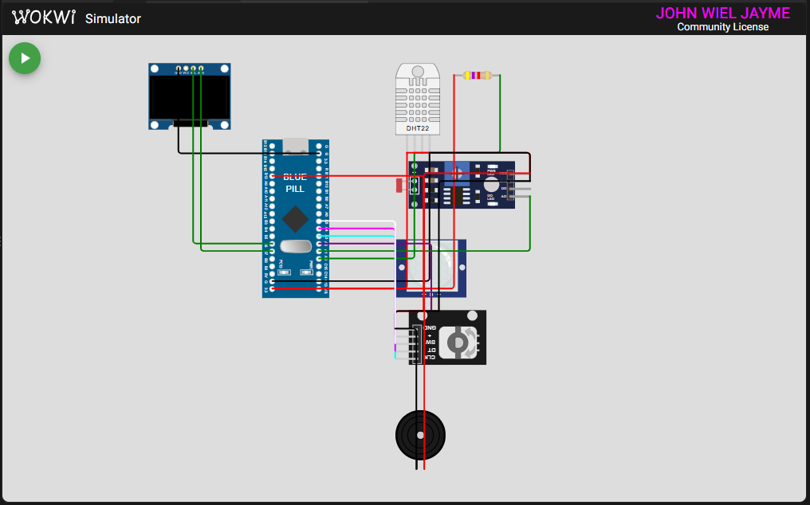
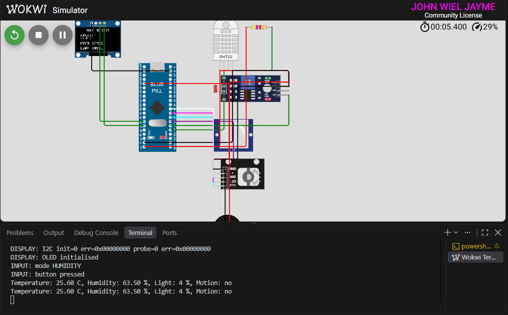

# BCA182 FreeRTOS Room Monitor

A simulated STM32 Blue Pill monitors temperature, humidity, relative light, and motion. FreeRTOS tasks move sensor data to an OLED and temperature alarm, while a rotary encoder highlights a reading on the display. The firmware uses PlatformIO, STM32Cube HAL, and native FreeRTOS APIs.

## Project Overview

This project implements the BCA182 multisensor laboratory on an STM32F103C8T6 Blue Pill in Wokwi. It combines periodic sampling, user input, alarm handling, and an inactivity state machine. The current application has six tasks and keeps hardware-independent decisions separate from HAL and RTOS code.

## Features

- DHT22 temperature and humidity samples every 2 seconds.
- LDR ambient-light reading reported as relative percent, not lux.
- OLED display shows one selected measurement at a time: temperature, humidity, light, or motion.
- KY-040 rotary encoder navigation.
- PIR motion tracking with ACTIVE and INACTIVE modes.
- Temperature alarm outside 18.0-30.0 C, with a 1 kHz PWM buzzer.
- Queue-based task communication, event-group state, and mutex-protected serial lines.
- Native Unity tests for alarm limits, display navigation, encoder decoding, and state transitions.

## Learning Objectives

The implementation demonstrates periodic FreeRTOS scheduling, task priorities, queues and queue sets, event groups, mutex ownership, an application state machine, STM32 peripheral access through HAL, and native testing of hardware-independent logic.

## System Architecture

**Figure 2. System architecture**



SensorTask publishes the newest valid sample to separate display and alarm queues. InputTask publishes the latest selected page. DisplayTask owns the OLED. MotionTask owns the current PIR event bit, StateTask owns the activity bit, and AlarmTask owns the alarm bit.



Editable diagram sources: [hardware and task architecture](docs/diagrams/architecture.mmd), [task communication](docs/diagrams/task-communication.mmd), and [activity state machine](docs/diagrams/state-machine.mmd). Project visuals are included below and the editable Mermaid sources are maintained in [docs/diagrams](docs/diagrams).


## FreeRTOS Architecture

The project uses a preemptive scheduler with explicit priorities. Periodic tasks block with `vTaskDelayUntil()`; queue consumers block while waiting for data or events.

## Hardware / Simulated Components

| Component | Role |
|---|---|
| STM32F103C8T6 Blue Pill | MCU; reset HSI clock at 8 MHz |
| DHT22 | Temperature and humidity |
| Photoresistor module | Relative ambient light through ADC1 |
| PIR sensor | Motion input |
| KY-040 encoder | Display-page selection |
| SSD1306 128x64 OLED | Selected-measurement display |
| Buzzer | Temperature alarm output |
| PC13 LED | Periodic heartbeat |

## Pin Configuration

| Pin | Connection |
|---|---|
| PA0 | DHT22 data, with 4.7 kOhm pull-up |
| PA1 | LDR analog output, ADC1 channel 1 |
| PA2 | PIR output |
| PA3 / PA4 / PA5 | Encoder CLK / DT / SW |
| PA8 | Buzzer PWM, TIM1_CH1 |
| PA9 / PA10 | USART1 TX / RX to Wokwi serial monitor |
| PB6 / PB7 | OLED I2C1 SCL / SDA, address 0x3C |
| PC13 | Heartbeat LED |

The circuit connections are maintained in [diagram.json](diagram.json).

## Task Design

| Task | Priority | Trigger / period | Responsibility | Typical blocking point |
|---|---:|---|---|---|
| MotionTask | 3 | 100 ms | Sample PIR and publish `EVENT_MOTION` | `vTaskDelayUntil()` |
| InputTask | 3 | 5 ms | Decode encoder and publish the selected display page | `vTaskDelayUntil()` |
| SensorTask | 2 | 2 s | Read DHT22/LDR and publish valid samples | `vTaskDelayUntil()` |
| AlarmTask | 2 | Sample arrival, 500 ms recheck | Evaluate temperature and drive PWM buzzer | `xQueueReceive()` timeout |
| StateTask | 2 | 100 ms | Apply the inactivity timeout and update activity state | `vTaskDelayUntil()` |
| DisplayTask | 1 | Queue event, 250 ms poll | Render the current page and own OLED writes | `xQueueSelectFromSet()` |

The priority levels favor input and motion response over periodic measurement and display refresh. Full task and object rationale is in [docs/design-notes.md](docs/design-notes.md).

## Inter-Task Communication

**Figure 3. FreeRTOS task communication**



- `xDisplayQueue` and `xAlarmQueue` are length-one queues. SensorTask overwrites each so both consumers independently receive the newest sample.
- `xModeQueue` carries the newest `DisplayMode` from InputTask to DisplayTask.
- `xDisplayEvents` is a queue set allowing DisplayTask to block on either display input queue.
- `xSystemEvents` holds `EVENT_ACTIVE`, `EVENT_MOTION`, and `EVENT_ALARM` status bits.
- `serialMutex` protects an entire USART1 line so task messages cannot interleave.

## State Machine

**Figure 4. ACTIVE / INACTIVE state machine**



The system starts ACTIVE. Motion refreshes the inactivity timer. After 15 seconds without motion, the state becomes INACTIVE: sensor reads pause, the buzzer is silenced, the OLED is blanked, and encoder changes are ignored. MotionTask continues polling the PIR; detected motion returns the system to ACTIVE.



## Repository Structure

```text
include/       Module APIs, RTOS configuration, and port macros
src/           HAL drivers, six tasks, and hardware-independent logic
lib/           PlatformIO library metadata
test/          Native Unity test suites
docs/          Design notes, verification, static analysis, and diagrams
platformio.ini PlatformIO build, native-test, and analysis environments
diagram.json   Wokwi circuit
wokwi.toml     Wokwi firmware and ELF paths
```

## Getting Started

Install PlatformIO Core or the VS Code PlatformIO extension, plus the Wokwi for VS Code extension. Clone this repository, open its directory in VS Code, and allow PlatformIO to install the STM32 platform, framework, compiler, and libraries.

## Building the Project

```powershell
pio run -e bluepill_f103c8
```

The firmware uses STM32Cube HAL and FreeRTOS; Arduino framework and Arduino APIs are not used.

## Running the Wokwi Simulation

**Figure 1. Wokwi circuit**



Build first, then run **Wokwi: Start Simulator** from the VS Code command palette. The simulation loads firmware using [wokwi.toml](wokwi.toml). DHT22 and light controls are available by clicking their components; use the PIR's motion control and encoder arrows/knob to exercise input behavior.

## Unit Testing

Run the hardware-independent decision tests with:

```powershell
pio test -e native
```

There are 17 tests across four suites: five alarm-boundary cases, four display-navigation cases, four encoder cases, and four state-transition cases. The latest recorded run passed all 17 tests.

## Static Code Analysis

Run:

```powershell
pio check -e bluepill_f103c8
```

The latest recorded cppcheck run passed with zero high- and medium-severity findings and 18 low-style cast findings. Per-file `unusedFunction` reports are suppressed because the PlatformIO check cannot see cross-translation-unit callers. Details are in [docs/static-analysis.md](docs/static-analysis.md).

## Functional Verification

**Figure 5. Finished system**



Wokwi functional verification FT-01 through FT-10 was completed on 2026-09-29. The tests covered temperature, humidity, light, clockwise and counterclockwise encoder navigation with wraparound, HIGH and LOW temperature alarms, PIR activation, the 15-second inactivity timeout, and PIR reactivation while INACTIVE.

Observed results included:
- FT-01: DHT22 temperature set to 25 C produced `Temperature: 25.00 C` and the OLED matched.
- FT-02: DHT22 humidity produced `Humidity: 63.50 %` and the OLED matched.
- FT-03: LDR/light values changed correctly, including a 4% reading.
- FT-04: Clockwise navigation cycled HUMIDITY -> LIGHT -> MOTION -> TEMPERATURE with wraparound.
- FT-05: Counterclockwise navigation reversed the order with wraparound.
- FT-06: 31 C produced a HIGH alarm and buzzer activation; returning to 20.30 C cleared the alarm.
- FT-07: Returning to the normal temperature range stopped the alarm and buzzer.
- FT-08: PIR motion changed the system from INACTIVE to ACTIVE and reported motion.
- FT-09: With no motion, the system entered INACTIVE after 15 seconds.
- FT-10: PIR motion while INACTIVE returned the system to ACTIVE.

The verification record is maintained in [docs/test-plan.md](docs/test-plan.md). These results are based on observed behavior of this repository's Wokwi firmware, not the reference project.

## Engineering Decisions

- The system retains the STM32 reset HSI clock at 8 MHz; APB1 therefore meets the STM32F1 I2C peripheral's minimum clock requirement.
- The OLED is owned by DisplayTask and displays one selected measurement at a time, matching the FR-05 single-measurement display requirement.
- HAL uses TIM4 for its 1 ms tick; FreeRTOS owns SysTick through the project Cortex-M3 port.
- The OLED is only written by DisplayTask, and the UART logger holds its mutex for one complete line.
- SensorTask skips a failed DHT22 sample instead of publishing invalid values.
- The pure logic modules have no HAL or FreeRTOS dependencies, allowing host-side tests.

## Limitations

- A DHT22 checksum or timing failure skips that sample; the next periodic read retries.
- The separate laboratory report PDF and portfolio publication have not yet been added.

## Future Improvements

Keep the verification record synchronized with observed runs, generate the separate laboratory report, and prepare the portfolio publication.

## References and Acknowledgments

- [FreeRTOS Kernel documentation](https://www.freertos.org/Documentation/RTOS_book.html)
- [STM32F1 HAL and CMSIS documentation](https://www.st.com/en/embedded-software/stm32cubef1.html)
- [Wokwi STM32 Blue Pill reference](https://docs.wokwi.com/parts/board-stm32-bluepill)
- [Unity test framework](https://github.com/ThrowTheSwitch/Unity)

