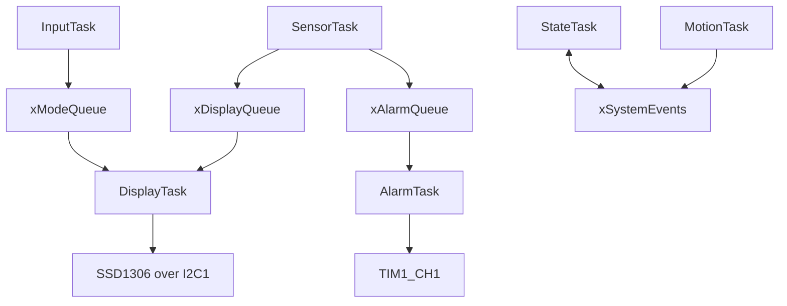
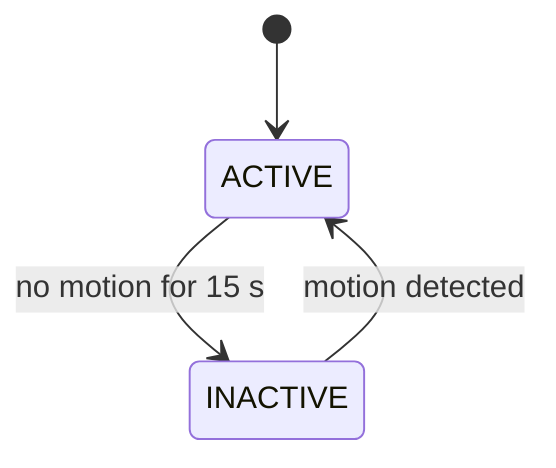

# BCA182 FreeRTOS Multisensor

STM32 Blue Pill room monitor built with PlatformIO, STM32Cube HAL, and native
FreeRTOS APIs. The Wokwi circuit measures temperature, humidity, and relative
light, detects motion, supports rotary-encoder navigation, displays one value
on an SSD1306 OLED, and sounds a temperature alarm.

## Features

- Six independently scheduled FreeRTOS tasks with explicit priorities.
- DHT22 temperature/humidity sampling and 0-100% relative-light measurement.
- OLED pages for temperature, humidity, light, and motion.
- PIR-driven ACTIVE/INACTIVE behavior with a 15-second inactivity timeout.
- Temperature alarm outside 18.0-30.0 C, using 1 kHz PWM on the buzzer.
- Queue, queue-set, event-group, and mutex communication.
- Native unit tests for alarm thresholds, display navigation, encoder input,
	and activity-state transitions.

## Hardware and Pins

| Blue Pill pin | Device signal |
|---|---|
| PA0 | DHT22 data |
| PA1 | LDR analog output, ADC1 channel 1 |
| PA2 | PIR output |
| PA3 / PA4 / PA5 | Encoder CLK / DT / SW |
| PB6 / PB7 | OLED I2C1 SCL / SDA, address 0x3C |
| PA8 | Buzzer PWM, TIM1_CH1 |
| PC13 | Heartbeat LED |
| PA9 | USART1 TX to Wokwi Serial Monitor |

## FreeRTOS Architecture

| Task | Priority | Work / blocking behavior |
|---|---:|---|
| MotionTask | 3 | Samples PIR every 100 ms with `vTaskDelayUntil()` |
| InputTask | 3 | Samples encoder every 5 ms with `vTaskDelayUntil()` |
| SensorTask | 2 | Reads sensors every 2 s; delays with `vTaskDelayUntil()` |
| AlarmTask | 2 | Waits for samples, rechecks activity at most every 500 ms |
| StateTask | 2 | Evaluates activity every 100 ms with `vTaskDelayUntil()` |
| DisplayTask | 1 | Blocks on a queue set, polling event bits at 250 ms |

`SensorTask` overwrites one-item queues for the display and alarm consumers.
`InputTask` overwrites the latest display mode. `DisplayTask` owns OLED writes
and selects between sample and mode queues. `xSystemEvents` carries ACTIVE,
MOTION, and ALARM bits. `serialMutex` protects each complete UART log line.
Details and state ownership are in [docs/design-notes.md](docs/design-notes.md).



Source diagrams: [system architecture](docs/diagrams/architecture.mmd),
[task communication](docs/diagrams/task-communication.mmd), and
[state machine](docs/diagrams/state-machine.mmd).

## State Machine

The system starts ACTIVE. Motion refreshes the inactivity timer; 15 seconds
without motion changes the state to INACTIVE. INACTIVE blanks the OLED, stops
sampling/alarming, and ignores encoder navigation while continuing to monitor
the PIR. Motion returns the system to ACTIVE.



## Build and Test

```powershell
pio run -e bluepill_f103c8
pio test -e native
pio check -e bluepill_f103c8
```

Latest local checks: firmware build passed; 17 native tests passed; cppcheck
passed with 0 high, 0 medium, and 18 low style findings. The low findings and
the cross-file `unusedFunction` suppression are documented in
[docs/static-analysis.md](docs/static-analysis.md).

## Wokwi Verification

Open the project in VS Code and start `Wokwi: Start Simulator`. The circuit
definition is [diagram.json](diagram.json), and firmware paths are in
[wokwi.toml](wokwi.toml). Current-project interaction tests are listed in
[docs/test-plan.md](docs/test-plan.md). A 2026-09-29 run confirmed 8 MHz
core/APB clocks, successful OLED I2C init/address probe, OLED rendering of
the HUMIDITY page, task startup, and an INACTIVE state transition. Sensor
value changes, full encoder wraparound, alarm/buzzer behavior, PIR
reactivation, and the visual INACTIVE behavior still need verification.

The current circuit and finished-system screenshots still need to be captured
for the portfolio README/report. The supplied reference screenshots belong to
the other project and are not represented as evidence for this build.

## Repository Structure

```text
include/    Public module interfaces, RTOS config, and port macros
src/        HAL drivers, FreeRTOS tasks, and pure decision logic
test/       Native Unity tests
docs/       Design notes, verification plan, and architecture diagrams
```

## Limitations and Remaining Submission Work

- DHT22 reads can fail timing/checksum validation; failed samples are logged
	and skipped rather than publishing fabricated readings.
- Wokwi functional checks still need to be recorded for this project build.
- The assignment's separate laboratory report PDF, portfolio screenshots, and
	Hackster.io publication are not included or claimed as complete.